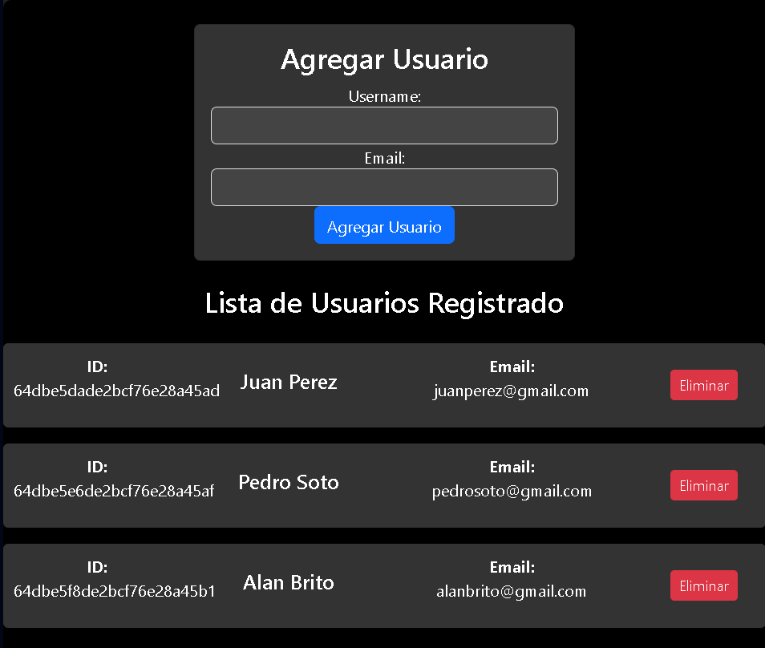
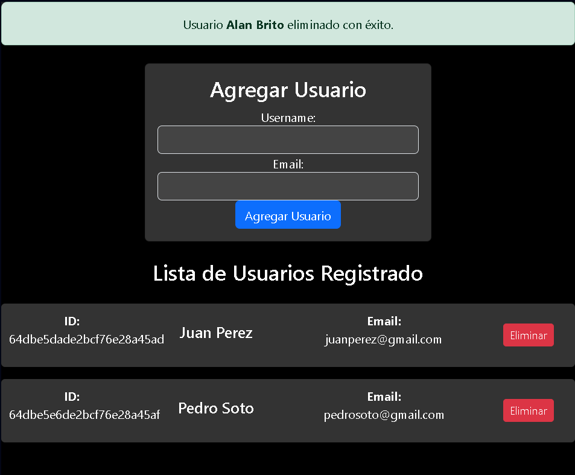
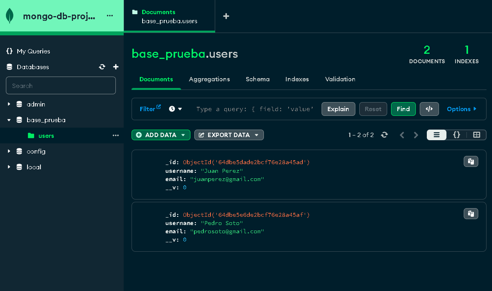

# Proyecto de Desarrollo Full Stack con React, Express y MongoDB

**Nota:** Este proyecto está diseñado para fines de desarrollo y aprendizaje. No está destinado a ser utilizado como una plataforma en producción.

Este proyecto te permite ejecutar un entorno de desarrollo Full Stack utilizando las tecnologías React, Express y MongoDB. Consta de un frontend en React en la carpeta `mongo-front`, un backend en Express en la carpeta `mongo-back`, y una base de datos MongoDB con datos persistentes en la carpeta `mongodb_data`.

## Requisitos previos

Antes de comenzar, asegúrate de tener instalados los siguientes componentes en tu máquina:

- [Docker](https://www.docker.com/get-started)
- [Docker Compose](https://docs.docker.com/compose/install/)

## Instrucciones de uso

Sigue estos pasos para utilizar el proyecto:

1. Clona el repositorio a tu máquina local:

   ```bash
   git clone https://github.com/tu-usuario/tu-repositorio.git
   ```

2. Navega a la raíz del proyecto:

   ```bash
   cd tu-repositorio
   ```

3. Ejecuta el comando Docker Compose para construir y levantar los contenedores:

   ```bash
   docker-compose up --build -d
   ```

   Este comando creará y configurará los contenedores para el frontend, backend y la base de datos MongoDB.

4. Accede a la aplicación en tu navegador web:

   - Frontend en React: [http://localhost:3000](http://localhost:3000)
   - Backend en Express: [http://localhost:5000](http://localhost:5000)

## Capturas de pantalla

### Imagen 1: Obtener todos los documentos guardados



### Imagen 2: Un documento eliminado



### Imagen 3: Vista de los documentos dentro de la base de datos



## Características

- El frontend y el backend se encuentran en carpetas separadas, `mongo-front` y `mongo-back` respectivamente.
- Los datos de la base de datos MongoDB se almacenan de manera persistente en la carpeta `mongodb_data`.
- Los volúmenes de Docker se utilizan para asegurar que los datos y cambios en el código sean persistentes a lo largo de los reinicios.
- Se ha configurado el live reloading para los cambios en el frontend y el backend, lo que significa que los cambios en el código se reflejarán de inmediato en la aplicación en ejecución.

## Personalización

Si deseas personalizar alguno de los componentes, puedes hacerlo modificando los archivos dentro de las carpetas `mongo-front`, `mongo-back` y ajustando la configuración en el archivo `docker-compose.yml`.

## Créditos

Este proyecto fue creado por [Leonardo Villagrán](https://github.com/Leonardo-villagran).
